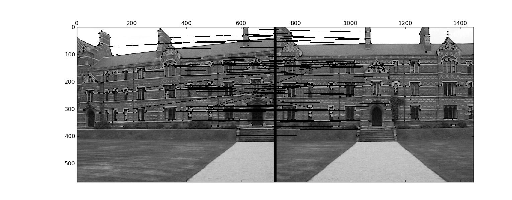
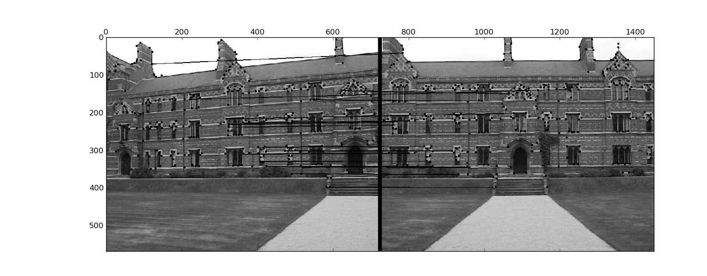
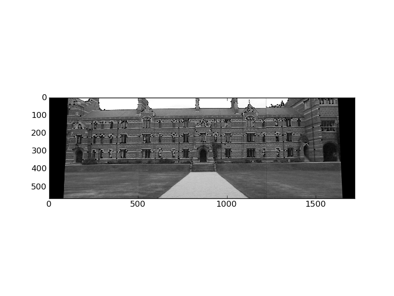
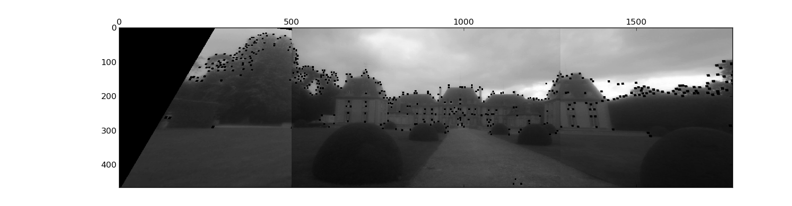

.. Panorama stitching documentation master file, created by
   sphinx-quickstart on Tue Oct 18 08:12:40 2011.
   You can adapt this file completely to your liking, but it should at least
   contain the root `toctree` directive.

Assignment 1: Stitching photo mosaic
==============================================


Homography
--------------------------------------------------------------------------------

:math:`\b{x_1}` and :math:`x_2` are respectively two images of :math:`X_1` and
:math:`X_2` taken by two cameras of same center :math:`O`.

As the cameras are rotating throught their centers, the image planes are
related through an homography.

.. math::

  $x_1 = K_1 [Id | 0] X_1$

  $x_1 = K_1 X_1$

  $x_2 = K_2 [R | 0] X_2$

  $x_2 = K_2 R X_2$

:math:`x_1` and :math:`x_2` are images of the same points :math:`X`
So we have :math:`X_1 = X_2 = X = K_1^{-1} x_1`

Therefore

.. math::

  $$x_1 = K_1^{-1} R K_2 $$

The derived homography :math:`H` does not depends on the scene: it only
depends on the camera center, the interal calibration matrixes and the image
planes.


The results
--------------------------------------------------------------------------------

I have coded the assignment using Python. I have not managed to parametrize
the Sift descriptors provided by VLFeat to match correctly on very simple
exemples (two squares). Therefore, in order to move forward with the
assignment, I have divided the work into two:

- The matching part, using patches of pixels to match. The results are better
  than the one I obtained using vlfeat, but not good enough to obtain
  consistant good results

- The warping and homography part, that I computed using hand matched
  descriptors


Matching
````````````````````````````````````````````````````````````````````````````````

For the matching, I used as threshold :math:`N1/N2` with a value of **0.6**.



Because of my poor descriptors, I do not have a high number of matches, and a
lot of wrong ones. I computed the RANSAC with 5000 iterations, using as
minimum matching value :math:`d = 10`
Normally, 30-100 iterations are plenty enough, but I have more than 50% of
outliers due to the sift descriptors missing.




unfortunately, matches after RANSAC are still not robust enough to do the
matching of the three images properly. I therefore used manual matching in
order to do the warping.

Warping
````````````````````````````````````````````````````````````````````````````````







