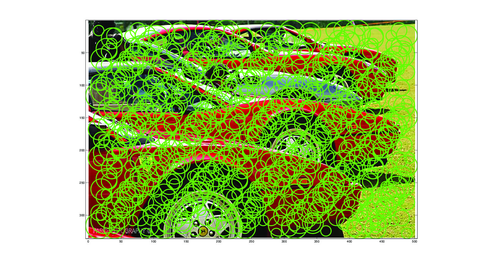
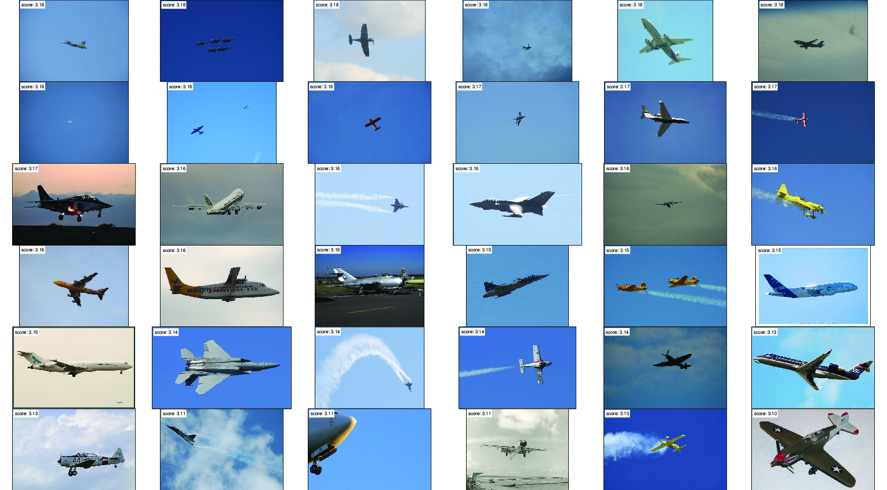
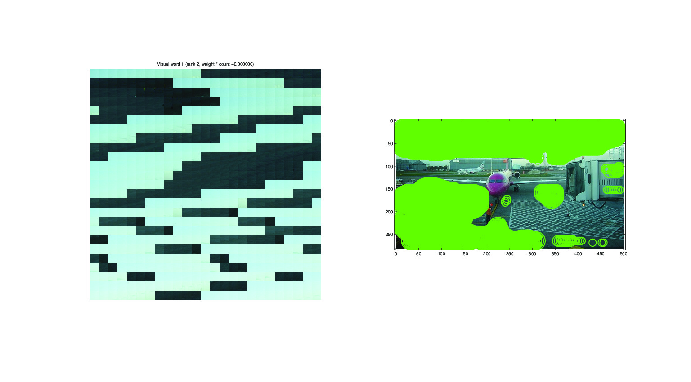
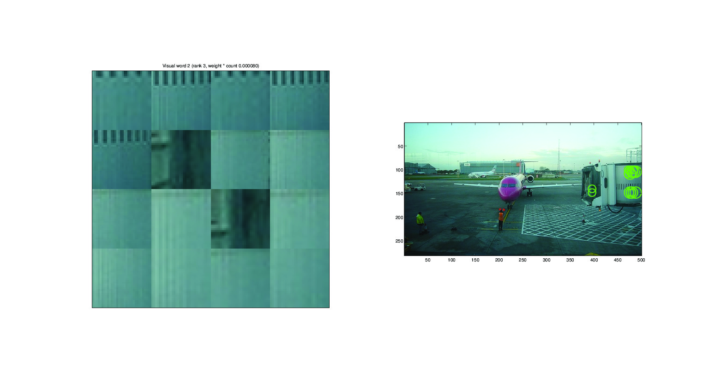
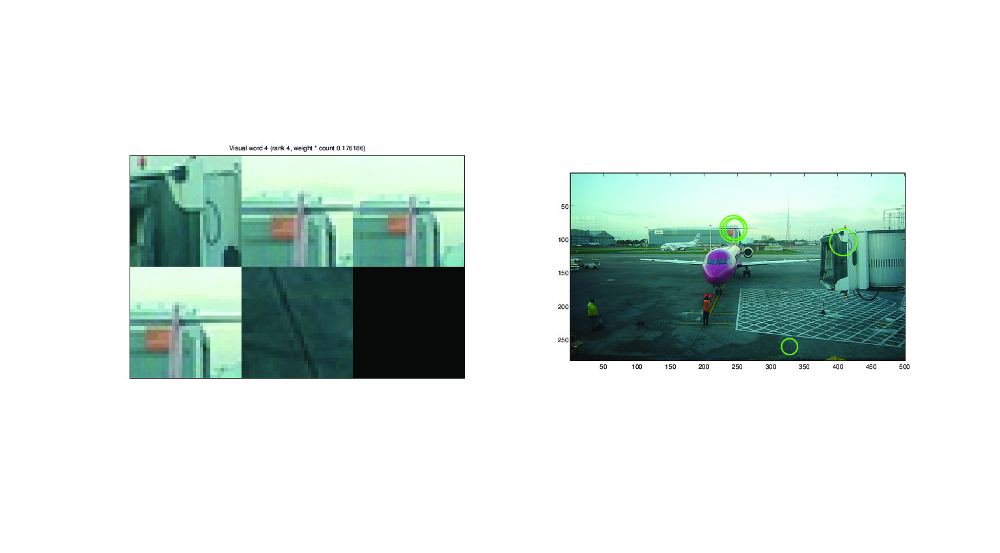

Stage A
================================================================================

The used scales of the extracted SIFT descriptors are 4, 6, 8 and 10bins.

The number of SIFT descriptors extracted for these scales respectively are
9480, 9282, 9163, 8968. The total number of SIFT descriptors extracted for
this image is 36893.

.. FIXME - this is really strange...
We extracted the SIFT descriptors using a spatial grid, and not interest
points. Therefore, the histogram image representation uses spatial tiling too.

Stage B: Train a classifier for images containing aeroplanes
================================================================================

Question B1
--------------------------------------------------------------------------------

Question B2
--------------------------------------------------------------------------------

