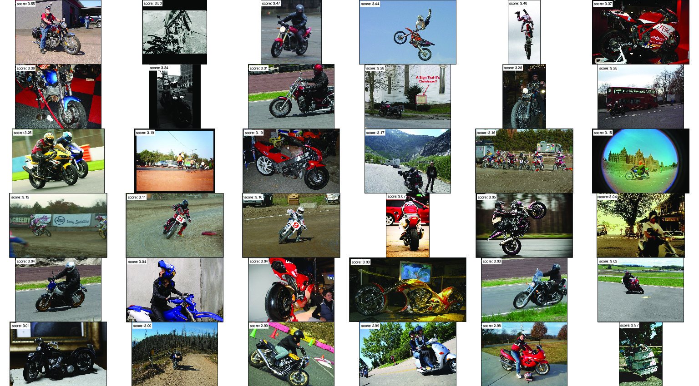
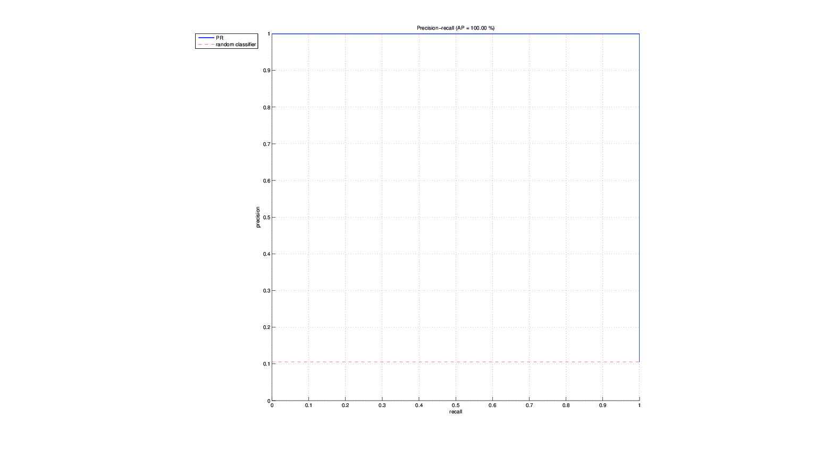
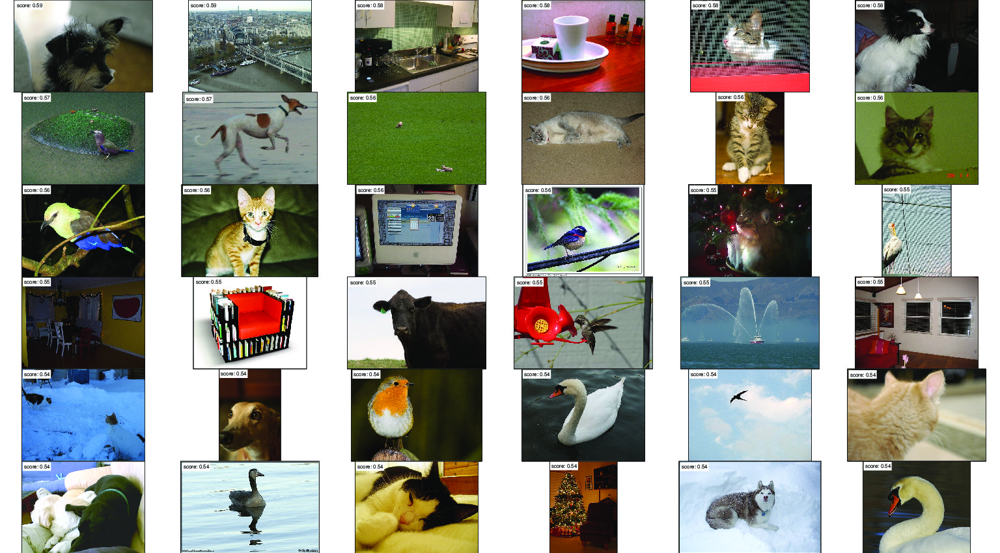
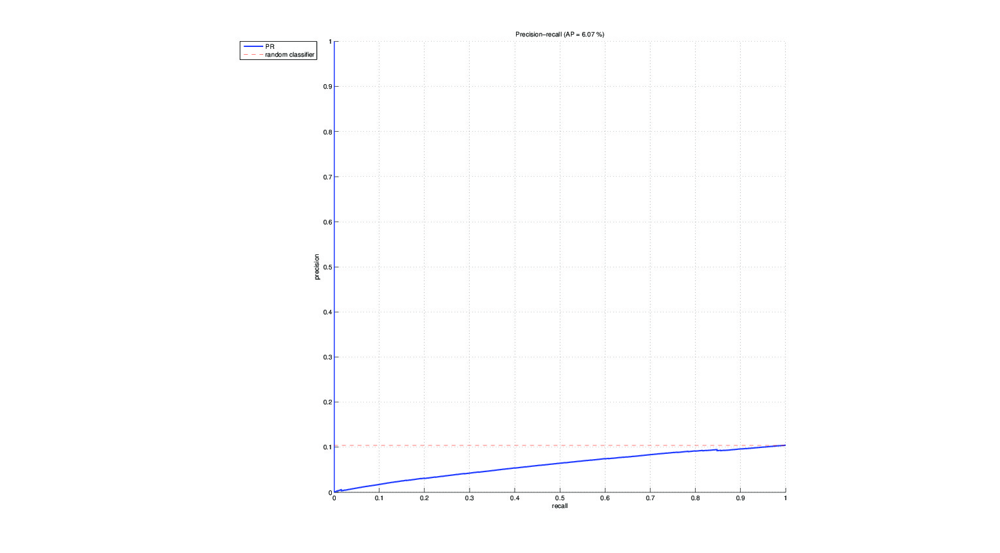
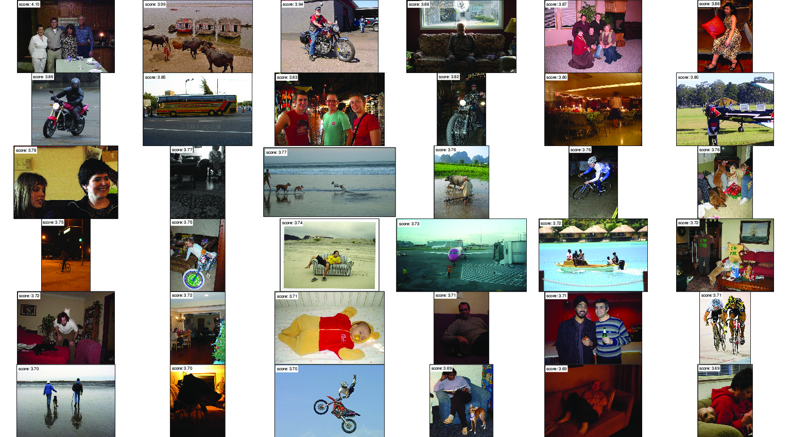
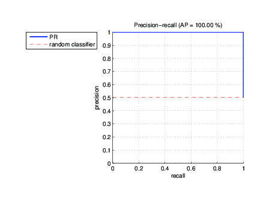
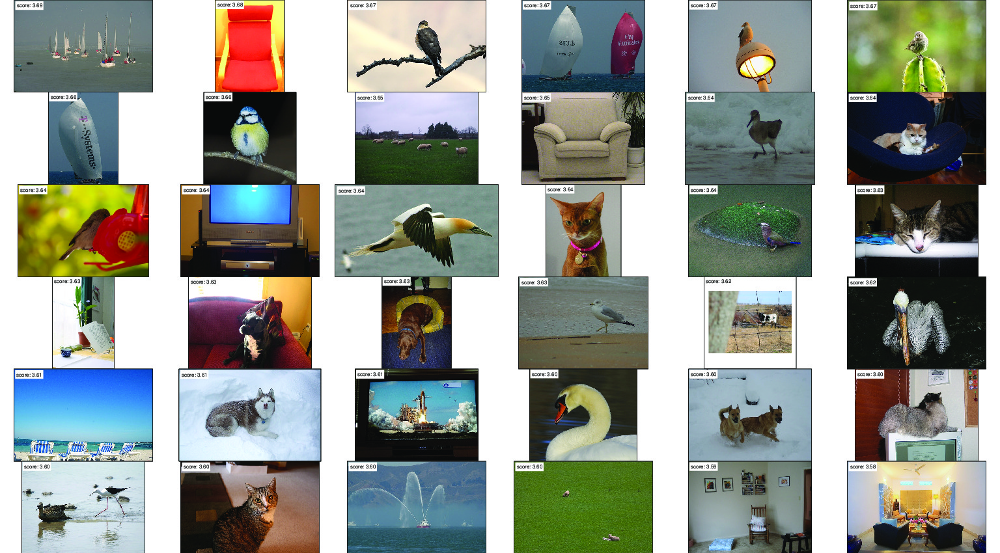
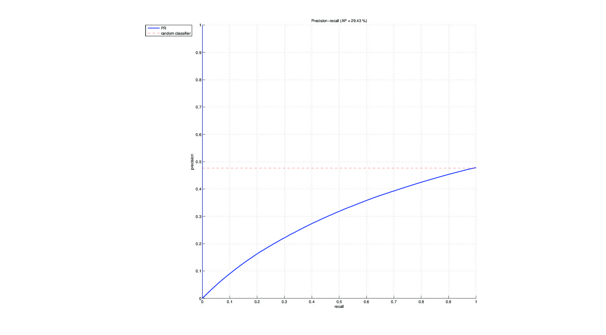

Stage A
================================================================================

.. image:: QA1_sift.jpg

The used scales of the extracted SIFT descriptors are 4, 6, 8 and 10bins.

The number of SIFT descriptors extracted for these scales respectively are
9480, 9282, 9163, 8968. The total number of SIFT descriptors extracted for
this image is 36893.

.. FIXME - this is really strange...
We extracted the SIFT descriptors using a spatial grid, and not interest
points. Therefore, the histogram image representation uses spatial tiling too.

Stage B: Train a classifier for images containing aeroplanes
================================================================================

Question B1
--------------------------------------------------------------------------------

.. image:: 01.jpg

Question B2
--------------------------------------------------------------------------------

.. image:: QB1_4.jpg

.. image:: QB1_5.jpg

.. image:: QB1_6.jpg

Stage C: Classify the test images and assess the performance
================================================================================

The bias term isn't necessary for image ranking, as the ranking is done by
comparing two scores. Therefore, the bias term is annulated when doing the
comparison.

The Average Precision on this dataset is 99% ! All of the 36 top images are
correct matches.

Stage D: Learn a classifier for the other classes and assess its performance
================================================================================

Motorbike
--------------------------------------------------------------------------------

.. FIXME there must be a problem with the AP

Person
--------------------------------------------------------------------------------

The person

